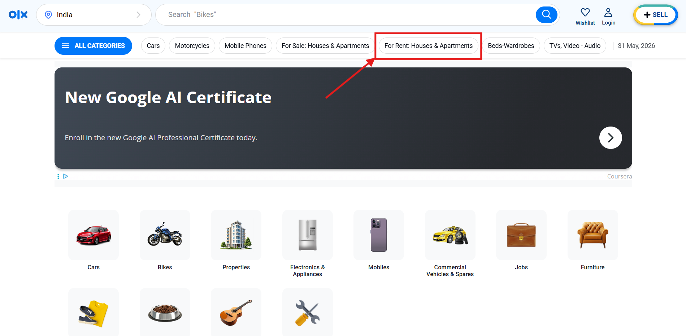
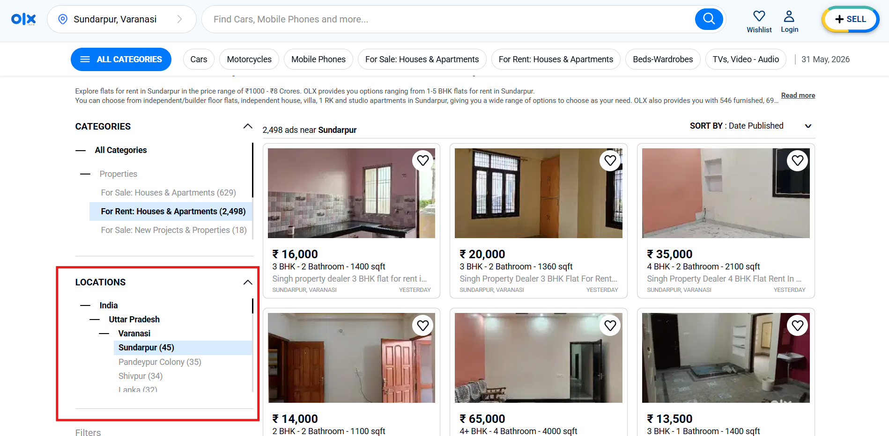
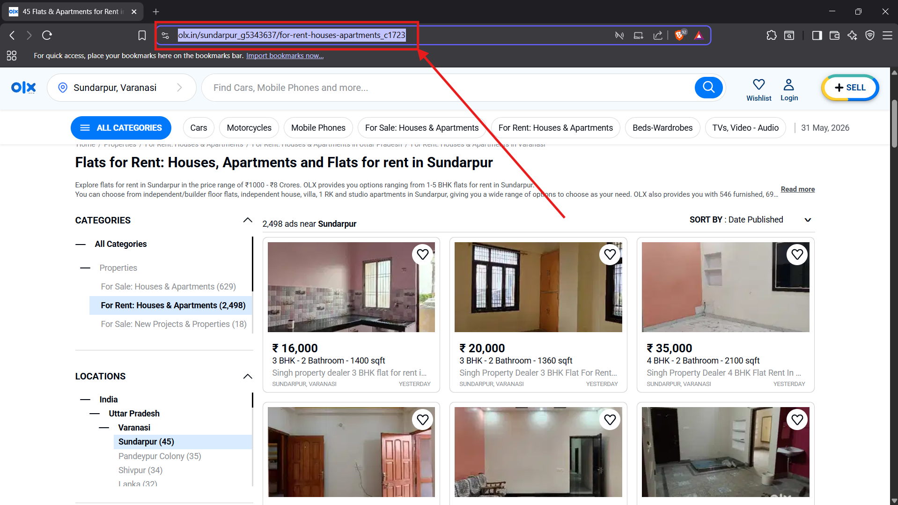

# OLX Rental Scraper

Looking for flats in 45-degree heat is a sport nobody signed up for.

At the end of the academic year, I kept seeing bachelors around me doing the same exhausting loop: open OLX, hunt through rental listings, check budgets, open every flat, guess whether it is owner-listed or dealer-listed, save links somewhere, and repeat the next day.

So I built a small desktop app that does the boring part for you.

OLX Rental Scraper is a local desktop scraper for OLX India rental listings. Paste an OLX location URL, choose your BHK and budget filters, start scraping, and the app stores matching flats in a local SQLite database that you can view inside the app.

## Download The Windows App

[](https://github.com/Divyam-Chauhan/Olx-Scraper/releases/download/v1.0.0/OLX_Rental_Scraper_Windows_v1.0.0.zip)

Direct download:

https://github.com/Divyam-Chauhan/Olx-Scraper/releases/download/v1.0.0/OLX_Rental_Scraper_Windows_v1.0.0.zip

Latest release page:

https://github.com/Divyam-Chauhan/Olx-Scraper/releases/latest

Download the attached Windows zip:

```text
OLX_Rental_Scraper_Windows_v1.0.0.zip
```

Do not download GitHub's automatic `Source code (zip)` or `Source code (tar.gz)` files if you just want to run the app. Those are generated by GitHub and do not contain the ready-to-use Windows build.

## What It Does

- Scrapes OLX India rental listings from a location URL that you provide.
- Supports 1 BHK, 2 BHK, and 3 BHK filters with separate min/max budgets.
- Filters for bachelor-friendly rental results using OLX URL filters.
- Opens listing detail pages to collect seller type and furnishing status when possible.
- Saves title, price, URL, seller type, posted date, BHK, furnishing, and scrape time.
- Deduplicates listings by URL so repeated runs do not flood the database.
- Lets you view and delete saved listings from the desktop UI.
- Handles CAPTCHA/block pages by pausing, alerting you, and asking you to solve the challenge in the opened browser.
- Auto-downloads Playwright Chromium on first scrape if it is missing.

## Windows User Guide

### 1. Install The App

1. Download `OLX_Rental_Scraper_Windows_v1.0.0.zip`.
2. Extract the zip file.
3. Open the extracted `OLX_Rental_Scraper` folder.
4. Run `OLX_Rental_Scraper.exe`.
5. If Windows SmartScreen appears, choose the option to run it anyway only if you trust this repository and release.

Do not run the `.exe` from inside the zip preview. Extract the folder first.

The first time you click Start Scraping, the app may download Chromium through Playwright. That is expected. Scraping OLX needs internet anyway, and after Chromium is installed once, future runs should skip that setup.

### 2. Get A Proper OLX Location URL

The app expects a real OLX location/category URL, not a plain search URL.

Open OLX India and choose `For Rent: Houses & Apartments`.



Select your exact area or neighborhood from OLX's location sidebar.



Copy the browser URL and paste it into the app.



The URL should look similar to this pattern:

```text
https://www.olx.in/en-in/sundarpur_g5343637/for-rent-houses-apartments_c1723
```

The important part is the location slug with `_g` and numbers, like `sundarpur_g5343637`. The app validates that location part and builds the filtered rental URL internally.

### 3. Choose Your Filters

Use the left panel to choose:

- 1 BHK, 2 BHK, and/or 3 BHK
- Min and max rent for each selected BHK type
- Maximum number of pages to scan

Defaults are set for a practical rental search, but you can adjust them before every run.

### 4. Start Scraping

Click Start Scraping.

The app will:

1. Check whether Playwright Chromium is installed.
2. Download it automatically if needed.
3. Open a visible Chromium browser.
4. Visit the filtered OLX rental results page.
5. Scan listing cards.
6. Open detail pages for new listings.
7. Save matching results to the local database.

You can watch progress in the Activity Log and the Processed, Saved, and Duplicates counters.

### 5. Handle CAPTCHA If OLX Blocks The Browser

OLX may sometimes show a Cloudflare/CAPTCHA page. When that happens:

1. The app pauses scraping.
2. You will get an alert.
3. A CAPTCHA modal appears in the app.
4. Switch to the opened Chromium browser.
5. Solve the challenge manually.
6. Return to the app and click the resume button.

This is intentional. The scraper does not bypass CAPTCHA; it pauses for a human to solve it.

### 6. View Saved Listings

Click View Database inside the app.

You can inspect saved listings, open the original OLX ads, select rows, and delete listings from the local database.

## macOS Source Run

There is no packaged macOS app yet, but macOS users can run the project from source if Python is installed.

```bash
git clone https://github.com/Divyam-Chauhan/Olx-Scraper.git
cd Olx-Scraper
python3 -m venv .venv
source .venv/bin/activate
python3 -m pip install -r requirements.txt
python3 -m playwright install chromium
python3 app.py
```

Notes for macOS:

- Keep the terminal open while the app runs.
- The app opens a local Eel desktop window.
- Playwright Chromium is required for scraping.
- CAPTCHA alerts use a cross-platform fallback outside Windows.
- A native distributable `.app` would need to be built on macOS.

## Where Data Is Stored

The app stores its SQLite database in your Documents folder:

```text
Documents/OLX_Scraper/olx_rentals.db
```

Saved rows include:

- title
- price
- URL
- seller type
- posted date
- BHK
- furnishing
- scraped timestamp

## Architecture

The app is intentionally small and local.

```text
Desktop UI
  web/index.html
  web/script.js
  web/style.css
        |
        | Eel JavaScript/Python bridge
        v
Backend app controller
  app.py
        |
        | starts worker thread, prepares Playwright Chromium
        v
Scraping engine
  scraper.py
        |
        | inserts and reads records
        v
SQLite database
  db.py -> Documents/OLX_Scraper/olx_rentals.db
```

### Frontend

The UI is plain HTML, CSS, and JavaScript served through Eel. It handles URL validation, BHK/budget inputs, scrape controls, progress logs, CAPTCHA prompts, stats, and the database viewer.

### Backend Controller

`app.py` starts the Eel desktop app, exposes Python functions to JavaScript, prevents multiple scraper threads from running at the same time, handles Stop/close behavior, and makes sure Playwright Chromium exists before scraping starts.

On packaged Windows releases, the app uses Playwright's bundled driver to download Chromium automatically instead of asking users to run terminal commands.

### Scraper

`scraper.py` uses Playwright's sync API in visible browser mode. It builds the OLX rental URL from the pasted location URL and selected BHK filters, navigates results pages, extracts listing cards, opens detail pages, detects CAPTCHA/block pages, and sends progress updates back to the UI.

### Database

`db.py` manages the local SQLite database. Listings are deduplicated by URL and saved with enough fields to compare flats later without reopening every OLX page.

### Packaging

`OLX_Rental_Scraper.spec` is the PyInstaller build definition. It collects the `web` folder, Eel, and Playwright into a Windows one-folder build:

```text
dist/OLX_Rental_Scraper/
  OLX_Rental_Scraper.exe
  _internal/
```

That whole `OLX_Rental_Scraper` folder is zipped and uploaded as the Windows release asset.

## Developer Setup On Windows

Install dependencies:

```powershell
py -3.11 -m pip install -r requirements.txt
```

Run from source:

```powershell
py -3.11 app.py
```

Build the Windows release:

```powershell
py -3.11 -m PyInstaller -y OLX_Rental_Scraper.spec
```

If the `py` launcher is unavailable, use the path to your own Python 3.11 executable. Do not copy machine-specific paths from another developer's computer.

After building, zip this whole folder:

```text
dist\OLX_Rental_Scraper
```

Do not zip only the `.exe`; the `_internal` folder is required.

## Limitations

- OLX may change its page structure, selectors, filters, or anti-bot behavior at any time.
- CAPTCHA pages still require a human to solve them.
- Seller type and furnishing are best-effort fields extracted from the detail page text.
- This is a local desktop tool, not a hosted service.
- The current ready-made release is Windows only.

## Responsible Use

Use this for personal, educational, and lightweight rental discovery. Respect OLX's terms, avoid aggressive scraping, and stop the scraper if the site asks you to verify or slow down.
